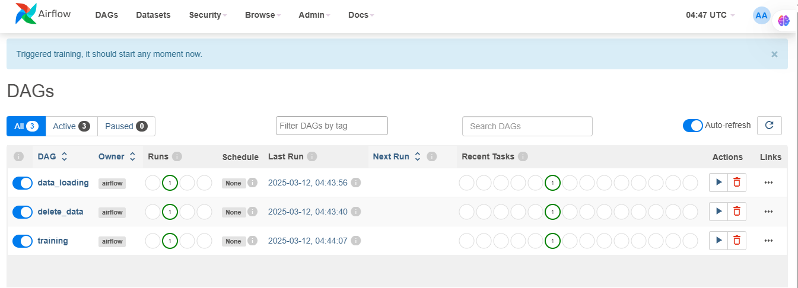

# Taller: Uso practico de Airflow

## 📌 Descripción

**Este repositorio contiene un entorno para el procesamiento de datos y entrenamiento de modelos basado en `Apache Airflow`, `Docker` y `Python`. Su diseño modular permite la automatización de flujos de trabajo con soporte para `PostgreSQL`, `MySQL` y `Redis`, mejorando la gestión y orquestación de tareas en entornos distribuidos.


El flujo de trabajo está diseñado para:

✅ **Gestionar datos en MySQL** mediante los DAGS `data_loading` y `delete_data`.  
✅ **Entrenar modelos automáticamente con `Airflow`** usando `train.py`.  
✅ **Hacer inferencias con `FastAPI`** sobre modelos previamente entrenados.  
✅ **Orquestar servicios con `Docker`**, incluyendo bases de datos (`PostgreSQL`, `MySQL`) y `Redis`.  
✅ **Facilitar la gestión de tareas en entornos distribuidos** con `CeleryExecutor`.  

---

## 🔄 **Flujo de Trabajo del Proyecto (DAGs en Airflow)**

Los flujos de trabajo están gestionados como **DAGs en Apache Airflow**, lo que permite ejecutar y programar cada proceso de manera automatizada.

1️⃣ **`delete_data` (DAG en Airflow)**  
   🔹 **Asegura que la base de datos MySQL esté limpia antes de cargar nuevos datos.**  
   🔹 **Elimina cualquier dato previo para evitar inconsistencias.**  

2️⃣ **`data_loading` (DAG en Airflow)**  
   🔹 **Lee el archivo `penguins_lter.csv` y carga los datos en MySQL.**  
   🔹 **Deja la información lista para su uso en entrenamiento.**  

3️⃣ **`train.py` (DAG en Airflow)**  
   🔹 **Entrena un modelo de Machine Learning con los datos cargados en MySQL.**  
   🔹 **Guarda el modelo como `SVM_model.pkl` en `/opt/airflow/datos/`.**  

4️⃣ **FastAPI (`main.py`)**  
   🔹 **Carga el modelo entrenado desde `/opt/airflow/datos/SVM_model.pkl`.**  
   🔹 **Expone el endpoint `/pinguino` para hacer inferencias.**  

💡 **Diagrama General del Flujo:**

```text
+-------------+       ① Elimina datos previos        +------------+
|  Airflow    |------------------------------------->| delete_data|
|  DAGs       |                                     | (DAG)      |
+-------------+                                     +------------+
      |
      |   ② Carga datos desde CSV en MySQL
      |--------------------------------------+
      |                                      ▼
      |                            +------------------+
      |--------------------------->| data_loading (DAG)|
      |                            +------------------+
      |
      |   ③ Entrena modelo con datos de MySQL
      |--------------------------------------+
      |                                      ▼
      |                            +------------------+
      |--------------------------->| train.py (DAG)   |
      |                            | Guarda modelo    |
      |                            | SVM_model.pkl    |
      |                            +------------------+
      |
      |   ④ FastAPI carga modelo entrenado
      |--------------------------------------+
      |                                      ▼
      |                            +------------------+
      |--------------------------->|  FastAPI (main.py)|
      |                            |  Predicciones    |
      |                            +------------------+
      |
      |    +----------------+
      |---->|   Usuario     |
           |  (Cliente API) |
           +----------------+
```
---

## 📂 Estructura del Proyecto

La estructura del proyecto está organizada para garantizar una correcta separación de responsabilidades y modularidad. Los flujos de trabajo se encuentran en la carpeta dags/, donde cada script maneja tareas específicas como la carga, eliminación y entrenamiento de datos. La carpeta app/ contiene los scripts principales de la aplicación, incluyendo el manejo de modelos y dependencias. La carpeta datos/ contiene los archivos de entrada requeridos para el procesamiento, mientras que logs/ almacena los registros de ejecución para facilitar el monitoreo. Los archivos de configuración, como docker-compose.yml y Dockerfile, permiten la implementación del entorno en contenedores, asegurando escalabilidad y reproducibilidad.

```
TALLER_3/
│── app/                      # Código de la aplicación principal
│   ├── cargar_modelos.py     # Script para carga de modelos
│   ├── Dockerfile.app        # Dockerfile específico para la app
│   ├── main.py               # Script principal
│   ├── requirements.txt      # Dependencias específicas de la app
│── dags/                      # Definición de flujos de trabajo
│   ├── carga_datos.py         # Carga de datos
│   ├── elimina_datos.py       # Eliminación de datos
│   ├── train.py               # Entrenamiento del modelo
│── datos/                     # Almacenamiento de datos
│   ├── penguins_lter.csv      # Conjunto de datos en formato CSV
│   ├── SVM_model.pkl          # Modelos entrenados, se guardan luego de ejecutar train.py
│── logs/                      # Registro de ejecución
│── plugins/                   # Extensiones para Airflow
│── docker-compose.yml         # Orquestación de servicios
│── Dockerfile                 # Construcción de la imagen Docker
│── README.md                  # Documentación del proyecto
│── requirements.txt           # Dependencias generales del proyecto
```

---

## 🛠 Instancia MySQL
Para crear la instancia de la base de datos mysql, fue necesario incluir el servicio mysql dentro del docker-compose y el volume mysql_data como se encuentra a continuación:

```
mysql:
    # Nombre del servicio
    image: mysql:latest  # Imagen Docker para el contenedor MySQL
    ports:
      - "3306:3306"  # Mapeo de puertos del contenedor al host
    environment:
      MYSQL_ROOT_PASSWORD: airflow  # Contraseña de root para MySQL
      MYSQL_DATABASE: penguin_data  # Nombre de la base de datos MySQL
    healthcheck:
      test: ["CMD", "mysqladmin", "ping", "-h", "localhost"]  # Comando de verificación de salud
      interval: 10s  # Frecuencia de la verificación de salud
      timeout: 5s  # Tiempo máximo de espera para la verificación de salud
      retries: 3  # Número de intentos de verificación de salud
      start_period: 10s  # Tiempo antes de iniciar las verificaciones de salud
    restart: always  # Política de reinicio del contenedor
```

## 🚀 **Instalación y Configuración**

### 1️⃣ **Clonar el repositorio**

1. Clonar el repositorio
```
git clone https://github.com/JohnSanchez27/MLOps_Taller3.git
cd MLOps_Taller3

```
2. Configuración de permisosç

Si hay errores al iniciar Airflow o FastAPI por problemas de escritura en directorios, ejecuta:

```
sudo chown -R $(whoami):$(whoami) datos logs
sudo chmod -R 777 datos logs

```

Si Airflow no tiene permisos para escribir en /opt/airflow/datos/, corrige dentro del contenedor:


```
docker exec -it airflow-worker bash
chmod -R 777 /opt/airflow/datos
exit
```

3. Construir el contenedor
```
docker-compose up --build
```

4. Acceder a las interfaces de Airflow y FastAPI

📌 Airflow UI
➡️ http://localhost:8080

📌 FastAPI Docs
➡️ http://localhost:8989/docs

5. Puedes verificar los contenedores activos con:

```
docker ps
```

Si alguno de los servicios no está corriendo, reinícialo con:

```
docker-compose restart <nombre_del_servicio>

```

🚀 ¡Listo! Ahora tienes todo configurado para entrenar modelos con Airflow y hacer inferencias con FastAPI. 🎉🔥

## 🔥 Retos del Uso de Airflow
El uso de Airflow en entornos productivos conlleva varios desafíos técnicos que deben ser considerados para su correcta implementación. La configuración inicial requiere definir correctamente las variables de entorno y la conexión entre servicios. La gestión de dependencias debe ser precisa para evitar incompatibilidades con la versión de Airflow utilizada. El monitoreo y depuración de errores es esencial debido a la generación de múltiples registros de ejecución. Para manejar grandes volúmenes de datos, es necesario optimizar la configuración de `CeleryExecutor` y los recursos asignados a `Redis`, `PostgreSQL` y `MySQL`. Además, la estructuración adecuada de los DAGs permite optimizar la ejecución y reducir tiempos de procesamiento.

## 📊 Uso
El proyecto se gestiona a través de la interfaz web de Airflow, donde se pueden visualizar, programar y ejecutar flujos de trabajo. Los DAGs ubicados en `dags/` pueden ser modificados para adaptarse a nuevos requerimientos o incorporar nuevas funcionalidades. Los registros de ejecución almacenados en `logs/` proporcionan información detallada sobre el estado de cada tarea, lo que facilita la depuración y optimización del sistema.

## 🌐 Vista de DAGs en Airflow

A continuación se muestra una captura de pantalla de la interfaz de Airflow, donde se visualizan los DAGs definidos para este proyecto:


